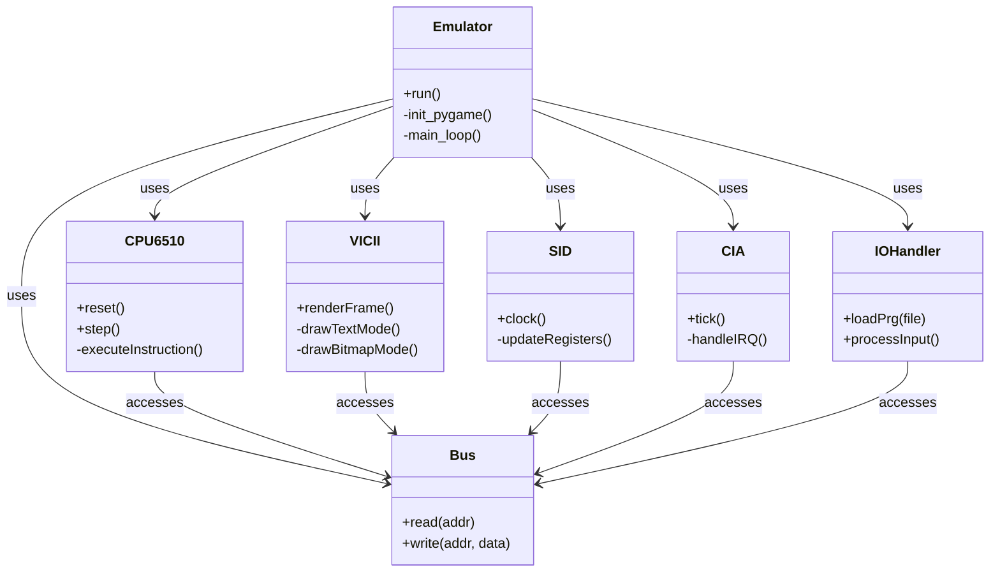

# Commodore 64 Emulator

## Description

This project is a full emulation of the Commodore 64 computer written in Python. It includes modules for emulating the MOS 6510 CPU, the VIC-II graphics chip, CIA1 and CIA2 timers and I/O controllers, the SID sound chip, and a simple GUI built with Pygame.

## Features

* **MOS 6510 CPU Emulation**: Support for all standard 6502 instructions.
* **Memory Mapping**: RAM, BASIC ROM, Kernel ROM, and Character ROM.
* **VIC-II Emulation**: Text and bitmap graphics modes, frame rendering with Pygame.
* **CIA1 & CIA2 Emulation**: Timers, interrupts, and I/O port handling.
* **SID Emulation**: Basic audio register handling and tick generation.
* **Pygame Interface**: Display window, keyboard input, and drag-and-drop `.prg` file loading.
* **BASIC Loader**: Automatic setup of BASIC pointers and loading of `.prg` files.
* *(Optional)* **1541 Disk Drive Emulation**: The DiskDrive module is available; enable by uncommenting in `src/bus/bus.py`.

## Requirements

* Python >= 3.12
* numpy == 2.2.1
* pygame == 2.6.1

## Installation

1. Clone the repository:

   ```bash
   git clone <REPO_URL>
   cd c64
   ```
2. Create and activate a virtual environment:

   ```bash
   python3 -m venv .venv
   source .venv/bin/activate   # Linux/MacOS
   .venv\\Scripts\\activate      # Windows
   ```
3. Install dependencies:

   ```bash
   pip install -r requirements.txt
   ```
4. Download the ROM files into the `rom/` directory (and create it if missing):

   ```bash
   mkdir -p rom
   curl -L https://www.zimmers.net/anonftp/pub/cbm/firmware/computers/c64/basic.901226-01.bin -o rom/basic.bin
   curl -L https://www.zimmers.net/anonftp/pub/cbm/firmware/computers/c64/kernal.901227-01.bin -o rom/kernel.bin
   curl -L https://www.zimmers.net/anonftp/pub/cbm/firmware/computers/c64/characters.901225-01.bin -o rom/chargen.bin
   curl -L https://www.zimmers.net/anonftp/pub/cbm/firmware/drives/new/1541/1540-c000.325302-01.bin -o rom/dos1541.bin
   ```

## User Guide

1. **Starting the Emulator**

   ```bash
   python main.py
   ```

   * A Pygame window will open emulating the C64 screen.
2. **Loading Programs**

   * Drag and drop a `.prg` file onto the emulator window.
   * The BASIC prompt appears; use the keyboard to type commands.
3. **Running BASIC Commands**

   * Type `LOAD"*",8,1` and press Enter to load from virtual disk (if 1541 support enabled).
   * Type `RUN` and press Enter to execute the loaded program.
4. **Keyboard Mapping**

   * The host keyboard maps to C64 keys automatically. Consult [KEYMAP.md](KEYMAP.md) for custom layout.
5. **Exiting**

   * Close the window or press `ESC` to quit the emulator.

## UML Diagrams

### Class Diagram



## Project Structure

```
c64/
├── rom/               # ROM files and sample .prg files
├── src/               # Emulator source code
│   ├── emulator/      # Emulator class and Pygame setup
│   ├── bus/           # System bus and memory mapping
│   ├── cpu/           # MOS 6510 CPU emulation
│   ├── vic/           # VIC-II graphics emulation
│   ├── sid/           # SID sound chip emulation
│   ├── cia/           # CIA1 and CIA2 timers/I/O emulation
│   ├── io/            # Keyboard input, .prg loader, disk drive interface
│   └── utils/         # Logging and utility functions
├── tests/             # Unit and integration tests
├── main.py            # Entry point
├── requirements.txt   # Dependencies
├── KEYMAP.md          # Keyboard mapping reference
├── LICENSE            # MIT License
└── README.md          # This file
```

## Testing

Run the test suite with pytest:

```bash
pytest
```

## Contributing

1. Fork the repository.
2. Create a new branch: `git checkout -b feature/your-feature-name`.
3. Implement your changes and commit them.
4. Push your branch and open a pull request.

## License

This project is licensed under the GNU License. See the [LICENSE](LICENSE) file for details.
