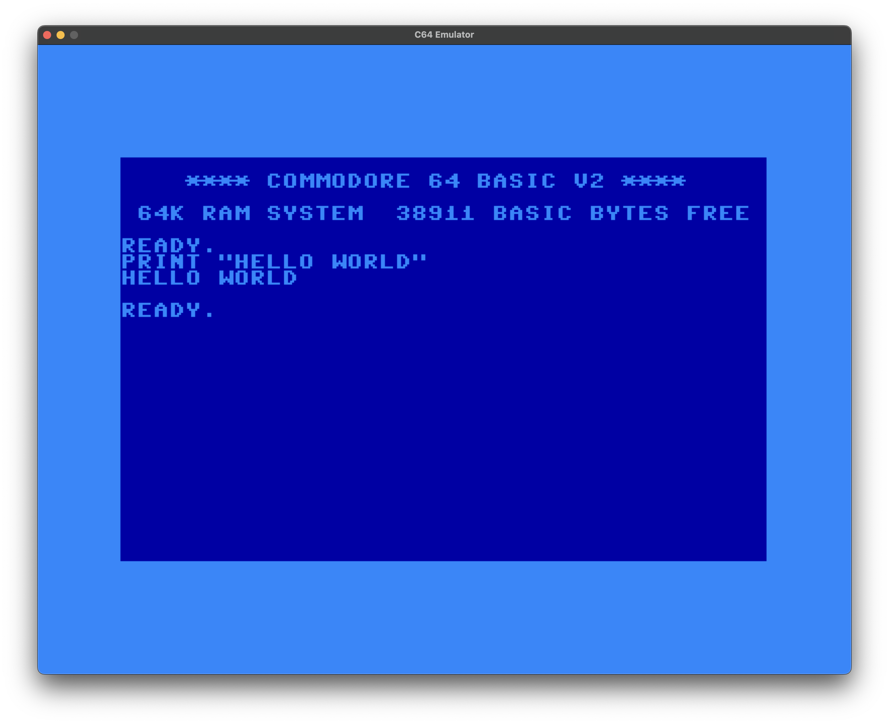
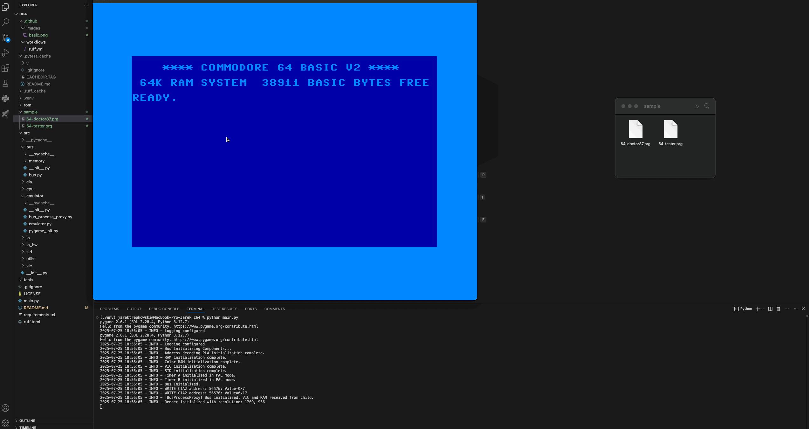
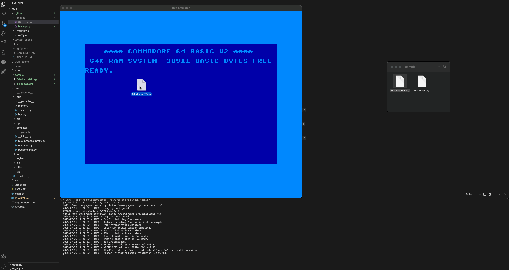
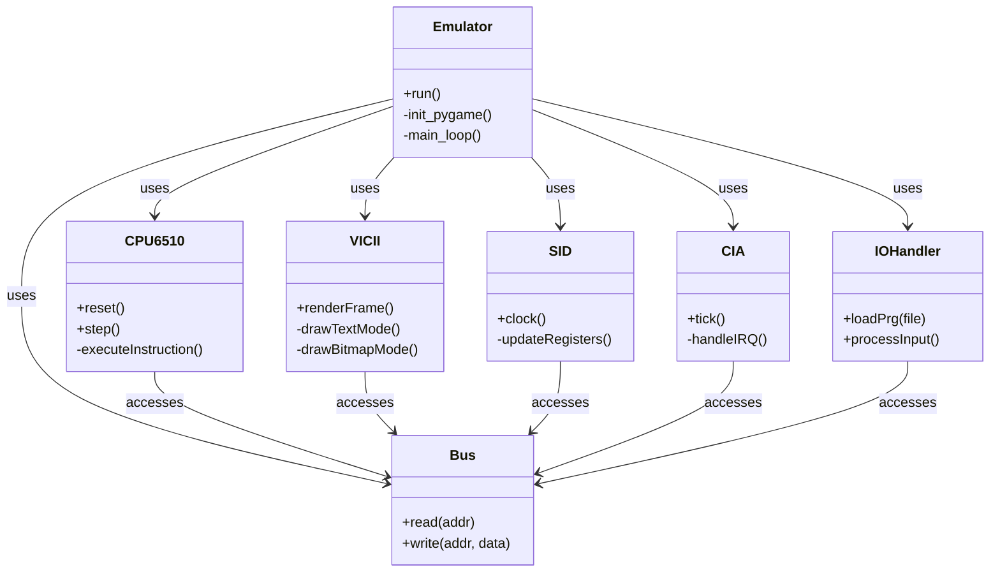

# Commodore 64 Emulator

## Description

This project is a **basic emulator** of the Commodore 64 written in Python.
Its main purpose is to **run simple BASIC programs stored in `.prg` files** and to show how an emulator is built, step by step. It covers the MOS 6510 CPU, memory map, a minimal VIC-II display, and input handling.

## 🖼️ Screenshot
This screenshot shows a simple PRINT command executed in the BASIC interpreter, demonstrating text rendering and keyboard input handling in the emulated environment.



## ▶️ Demo 1: Sprite & RAM Tester

A lightweight diagnostic program that visualizes C64 RAM and sprite memory. Useful for verifying basic video memory access and display via the VIC-II module.



## ▶️ Demo 2: Memory Mapper & CIA Tester

A more advanced diagnostic tool that tests multiple hardware components including CIA-driven memory mapping. Demonstrates support for dynamically remapped address spaces and I/O handling.



## Project Assumptions

* The goal is **not** to reach 100 % hardware accuracy.
* It must be able to **load and start small `.prg` files** without extra loaders.
* Extra chips such as SID and full CIA1/CIA2 support are still missing.
* Code should stay clear and short so it is easy to study.

## Author & AI Collaboration

I developed this project with strong help from AI tools.
The AI supported me with:

* Code flow ideas and naming
* Quick research on C-64 internals and data-sheets
* Small assembler examples and bug hunting

However, the project also shows that **AI alone cannot finish a full emulator**. A human still has to design the structure, understand corner cases, and test the result.
My background is **software engineering with a focus on quality-process automation**, which helped in planning and testing the codebase.

## Features

| Status | Module       | Notes                                      |
| ------ | ------------ | ------------------------------------------ |
| ✅      | MOS 6510 CPU | All documented 6502 instructions           |
| ✅      | Memory map   | BASIC, KERNAL, CHAR ROM, RAM               |
| ✅      | Basic VIC-II | Text and bitmap modes, drawn with Pygame   |
| 🟡     | CIA1 & CIA2  | Only timers A/B and IRQ mask; no TOD clock |
| ❌      | SID sound    | Not yet implemented                        |
| 🟡     | 1541 drive   | Skeleton class; disabled by default        |

Legend: **✅ ready · 🟡 partial · ❌ missing**

Additional details:

* **Drag-and-drop**: Drop a `.prg` file on the window to auto-load it.
* **Pygame interface**: Keyboard mapping and window output.
* Works **without custom loaders**; the emulator adjusts the BASIC pointers for you.

## Limitations

* No sound, because SID emulation is still on the to-do list.
* CIA1/CIA2 do not yet cover all registers, so some demos or games can fail.
* Cycle timing is approximate; programs that depend on exact raster timing may break.

## Roadmap

1. Finish CIA1/CIA2 (TOD clock, serial lines, full interrupts).
2. Add a very rough SID channel so simple tones can play.
3. Improve timing and add a “fast-load” option for large files.
4. Optional: grow the 1541 module into a working drive with GCR decoding.

## Requirements

* Python >= 3.12
* numpy == 2.2.1
* pygame == 2.6.1

## Installation

```bash
git clone <REPO_URL>
cd c64
python3 -m venv .venv
source .venv/bin/activate        # or .venv\Scripts\activate on Windows
pip install -r requirements.txt
```

Then place the original ROM images in the `rom/` folder (see below).

## ROM Download

```bash
mkdir -p rom
   curl -L https://www.zimmers.net/anonftp/pub/cbm/firmware/computers/c64/basic.901226-01.bin -o rom/basic.bin
   curl -L https://www.zimmers.net/anonftp/pub/cbm/firmware/computers/c64/kernal.901227-01.bin -o rom/kernel.bin
   curl -L https://www.zimmers.net/anonftp/pub/cbm/firmware/computers/c64/characters.901225-01.bin -o rom/chargen.bin
   curl -L https://www.zimmers.net/anonftp/pub/cbm/firmware/drives/new/1541/1540-c000.325302-01.bin -o rom/dos1541.bin
```

(Replace the URLs with mirrors of your choice.)


## Quick Start

```bash
python main.py
```

* A C-64 screen appears.
* Drag a `.prg` file onto it.
* Type `RUN` and press **Enter**.

Press **Esc** or close the window to quit.


## UML Diagrams

### Class Diagram



## Project Structure

```
c64/
├── rom/               # ROM files and sample .prg files
├── src/               # Emulator source code
│   ├── emulator/      # Emulator class and Pygame setup
│   ├── bus/           # System bus and memory mapping
│   ├── cpu/           # MOS 6510 CPU emulation
│   ├── vic/           # VIC-II graphics emulation
│   ├── sid/           # SID sound chip emulation
│   ├── cia/           # CIA1 and CIA2 timers/I/O emulation
│   ├── io/            # Keyboard input, .prg loader, disk drive interface
│   └── utils/         # Logging and utility functions
├── tests/             # Unit and integration tests
├── main.py            # Entry point
├── requirements.txt   # Dependencies
├── LICENSE            # MIT License
└── README.md          # This file
```

## Testing

Run all unit tests with:

```bash
pytest
```

## Contributing

Pull requests are very welcome, especially for missing chips or performance fixes.
Feel free to open issues for discussion.

## Contact

Interested in working together or adding new components?
Write to **[jaroslawtrepkowski@gmail.com](mailto:jaroslawtrepkowski@gmail.com)** – I am open to ideas and cooperation.

## License

This project is released under the GNU GPL. See the [LICENSE](LICENSE) file for details.
